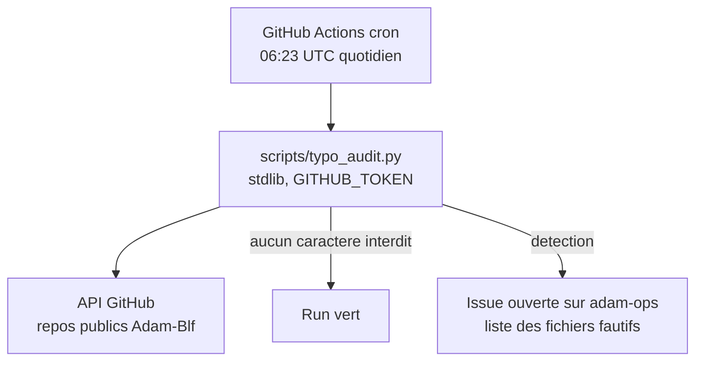

# adam-ops

<!-- adam-badges:start -->
[](https://github.com/Adam-Blf/adam-ops/commits)
[](https://hits.sh/github.com/Adam-Blf/adam-ops/)
[](https://github.com/Adam-Blf/adam-ops/commits)
[](https://github.com/Adam-Blf/adam-ops)
[](LICENSE)
<!-- adam-badges:end -->


Garde-fous automatiques des repos Adam-Blf. Applique les regles
d'exploitation du proprietaire (typographie, qualite) en CI, sans
intervention manuelle.

## Features

- [x] Audit typographique quotidien de tous les repos publics (README +
  description) : echec + issue si tiret cadratin, demi-cadratin,
  mediopoint ou puce detecte

## Architecture



## Regles verifiees

Caracteres interdits dans les README et descriptions : `U+2014` (tiret
cadratin), `U+2013` (demi-cadratin), `U+00B7` (mediopoint), `U+2022`
(puce). Remplacement attendu : tiret court, virgule ou point.

## Lancer en local

```bash
GITHUB_TOKEN=$(gh auth token) python scripts/typo_audit.py
```

## Limites

Les repos prives ne sont pas audites (GITHUB_TOKEN du workflow limite
aux repos publics de l'utilisateur).

## Licence

MIT, voir [LICENSE](LICENSE).
